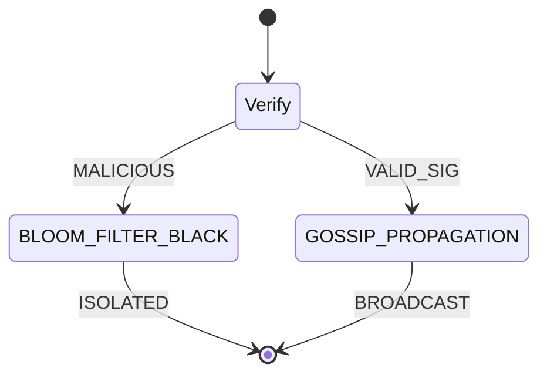

# 🐝 fynq.gridbee

<div align="center">
  
</div>

<div align="center">

> **A Bio-Inspired Supercomputer.**
> *Mimicking biological swarms to transform heterogeneous consumer hardware into a self-healing AI training cluster.*

 
 
 


[ **[LAUNCH MISSION BRIEFING](http://localhost:3000/architecture.html)** ]

</div>

---

## 🍯 The Mission

**Gridbee** solves the GPU scarcity crisis by utilizing the deadweight of idle consumer devices. Unlike traditional distributed computing, Gridbee operates like a **biological organism**:

*   **0-Config Discovery**: Nodes find each other automatically via UDP beacons.
*   **Systolic Execution**: Computation flows in rhythmic pulses (North/West) like a heartbeat.
*   **Immune Defense**: Malicious nodes are quarantined via a decentralized "Gossip" protocol.

---

## 🧬 System Architecture

### 1. The Nervous System (Topology)
The network organizes itself into a perfect `10x10` Torus Mesh. Every node has exactly 4 recurring neighbors, minimizing latency hops.

```mermaid
graph TD
    User([EXT_CLIENT]) -->|WSS| Queen{QUEEN_NODE}
    Queen -->|UDP| Discovery[DISCOVERY_LAYER]
    Discovery -->|JOIN| W1[BEE_0,0]
    Discovery -->|JOIN| W2[BEE_0,1]
    
    subgraph Mesh [HIVE_TORUS_10x10]
        direction LR
        W1 <--> W2
        W1 <--> W3[BEE_1,0]
        W2 <--> W4[BEE_1,1]
        W3 <--> W4
    end
    
    style Mesh fill:#0a0a0a,stroke:#00ff41,stroke-dasharray: 5 5
    style Queen fill:#003300,stroke:#00ff41,stroke-width:2px
    style User fill:#050505,stroke:#fff,stroke-width:2px
```



### 2. The Digestive System (Sharding)
Massive AI models are broken down using **Greco-Latin Squares** to ensure mathematical redundancy. This is a **Level 2 Sub-Architecture** ensuring no two nodes hold the same row/column pair.

```mermaid
flowchart TD
    M(MODEL_BLOB) -->|DIVIDE| B1(BLOCK_A)
    M -->|DIVIDE| B2(BLOCK_B)
    
    subgraph Lead [LEAD_PROCESS]
        B1 --> GLS{GLS_ENGINE}
        GLS --> S1[TASK_01]
        GLS --> S2[TASK_02]
    end
    
    S1 --> W1[WORKER_X]
    S2 --> W2[WORKER_Y]
    
    style Lead fill:#1a0033,stroke:#8b5cf6,stroke-width:2px,stroke-dasharray: 5 5
```



### 3. The Immune System (Security)
A Zero-Trust BFT (Byzantine Fault Tolerance) layer ensures result integrity. Each node acts as a **Lymphocyte**, verifying signatures before propagation.



---

## � Sub-System Breakdown

| Protocol | Description | Biological Metaphor |
| :--- | :--- | :--- |
| **Spike Protocol** | Hardware profiling (RAM, VRAM, CPU) to determine if a node is fit for "Prince" status. | **Hormonal Regulation** |
| **Bitchat Mesh** | A dedicated P2P WebSocket layer for inter-node whisper communication. | **Synaptic Firing** |
| **Bloom Filters** | Probabilistic data structure for instant, O(1) blacklisting of malicious IPs. | **Antibodies** |
| **Parity XOR** | Reconstructs missing data shards if a node disconnects mid-training. | **Regeneration** |

---

## �🔄 Workflow Simulation: The Lifecycle of a Tensor

This describes the journey of a data packet through the Gridbee Hive.

### Phase 1: Discovery & Allocation (The Handshake)
- **Checkpoint**: Queen broadcasts UDP Beacon on port `41234`.
- **Action**: New Bees respond with hardware specs (RAM, VRAM, CPU).
- **Result**: Queen assigns `(i, j)` coordinates based on the `10x10` Torus map.

### Phase 2: Digestion (The Split)
- **Checkpoint**: Large model weights arrive at **Lead Bees**.
- **Action**: Lead Bees execute **Recursive Micro-Sharding**.
- **Result**: Data is split into orthogonal chunks using **Greco-Latin Squares**.

### Phase 3: Circulation (The Pulse)
- **Checkpoint**: **Systolic Engine** initialization.
- **Action**: All nodes pulse data **North** and **West** simultaneously.
- **Result**: Matrix multiplication occurs in-flight without central coordination.

### Phase 4: Immunity (The Audit)
- **Checkpoint**: Result generation.
- **Action**: **Lymphocytes** verify cryptographic signatures.
- **Result**: If a mismatch is found, a **Gossip Flag** is propagated via `Bitchat`.

### Phase 5: Unmasking (The Assembly)
- **Checkpoint**: Verified results return to Queen.
- **Action**: Queen applies **Inverse Obfuscation**.
- **Result**: Final optimized model is saved.

---

## 🌍 Real-World Use Cases

Gridbee is designed for high-stakes decentralized compute.

### 🏥 Hospitals (Private Med-LLM)
Training diagnostic models across multiple clinics without patient data ever leaving local nodes. The Queen only unmasks weights, never raw data.

### 💸 Finance (Fractal Audit Grid)
Processing millions of micro-transactions per second using the **Systolic Pulse** to find fraud patterns without a central server bottleneck.

### 🎬 Creatives (Decentralized Rendering)
Utilizing 10,000 "Bees" to render 8K frames in parallel, where each Lead handles a specific texture block (**Recursive Sharding**).

---

## 🕹️ Gamified Roles & Badges

The system assigns roles dynamically based on hardware capability (**PMI Score**).

| Role | Badge | Responsibility | Hardware Req |
| :--- | :---: | :--- | :--- |
| **THE QUEEN** | 👑 | **Orchestrator**. Managing the registry and final assembly. | High CPU, Stable Net |
| **PRINCE** | 🏰 | **Failover Node**. Maintains Raft logs to become Queen if she dies. | High VRAM (>12GB) |
| **LEAD BEE** | 🛡️ | **Regional Manager**. Handles sharding limits and micro-tasks. | High RAM (>32GB) |
| **WORKER** | 🐝 | **The Swarm**. Pure compute power for tensor operations. | Any GPU/TPU |

---

## 📂 Project Structure

```bash
fynq.gridbee/
├── 📂 public/              # Information Deck
│   ├── architecture.html   # 🕹️ Gamified Mission Briefing
│   └── dashboard.js        # Command Center Logic
├── 📂 server/              # The Queen (Node.js)
│   └── discovery.js        # UDP Beacon & WebSocket Orchestrator
├── 📂 worker/              # The Bees (Python)
│   ├── bee.py              # Main Worker Entrypoint
│   ├── immune.py           # Lymphocyte & Bloom Filters
│   ├── mesh.py             # Bitchat P2P Networking
│   ├── lead_logic.py       # Greco-Latin Sharding
│   └── raft_manager.py     # Prince Consensus Logic
└── README.md               # You are here
```

---

## 🚀 How to Deploy

### Prerequisites
*   **Node.js v18+** (for the Queen/Dashboard)
*   **Python 3.9+** (for Worker Bees)
*   **Dependencies**: `ws`, `psutil`, `websockets`, `aiohttp`

### 1. Awakening the Queen
Start the central nervous system. This also launches the **Command Center**.
```bash
node server/discovery.js
```
> *Open [http://localhost:3000](http://localhost:3000) to view the CLI Dashboard.*

### 2. Spawning the Swarm
Open multiple terminal tabs to simulate a distributed cluster.
```bash
python3 worker/bee.py
```

### 3. Graceful Pruning Test
Simulate a node failure to test the **Immune System**.
1.  Connect a Worker.
2.  Press `Ctrl+C` to kill it.
3.  Watch the Dashboard—the cell will instantly turn **GRAY** (Graceful Pruning).

---

<div align="center">
    <pre style="color: #00ff41;">
   ____ ____ ___ ____  ____  _____ _____ 
  / ___|  _ \_ _|  _ \| __ )| ____| ____|
 | |  _| |_) | || | | |  _ \|  _| |  _|  
 | |_| |  _ <| || |_| | |_) | |___| |___ 
  \____|_| \_\___|____/|____/|_____|_____|
    </pre>
    <p style="letter-spacing: 4px; font-size: 10px;">GRIDBEE CORE // UNIT_5 // BUILT_ON_FYNQ</p>
</div>
